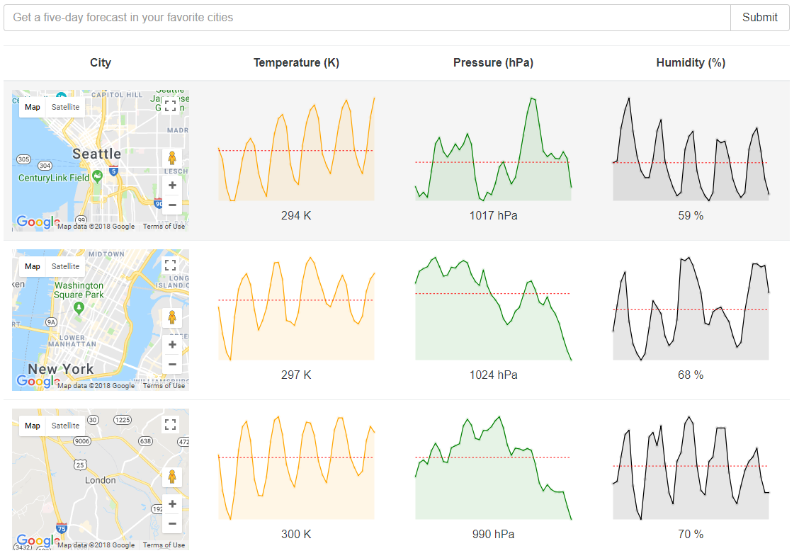

# WeatherClient

The simple weather client to show using [react], [redux].

For HTTP requests is using [axios].

For displaying charts is using [sparklines].

The weather fetches from [openweather] and maps show by [google maps] API.

## Sample screen

[react]: <https://reactjs.org>
[redux]: <https://redux.js.org/introduction>
[axios]: <https://github.com/axios/axios>
[sparklines]: <https://github.com/borisyankov/react-sparklines>
[openweather]: <https://www.openweathermap.org>
[google maps]: <https://developers.google.com/maps/documentation/javascript>
